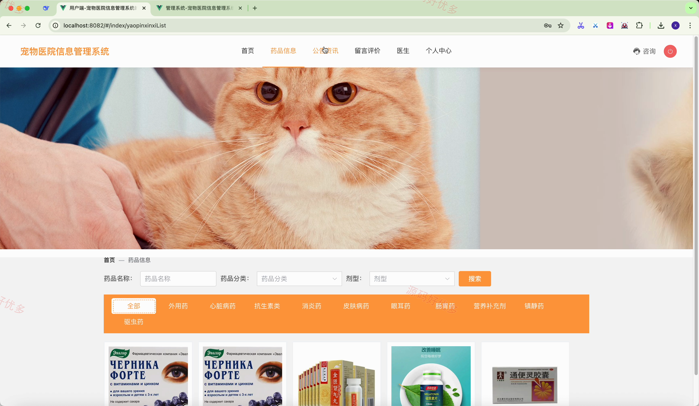
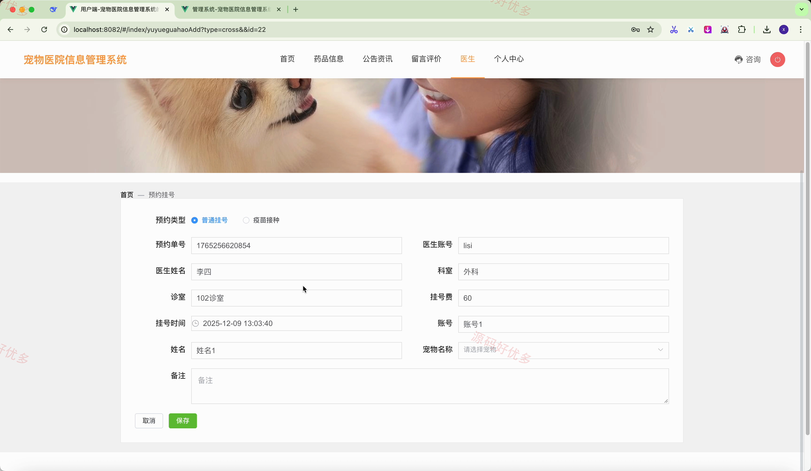
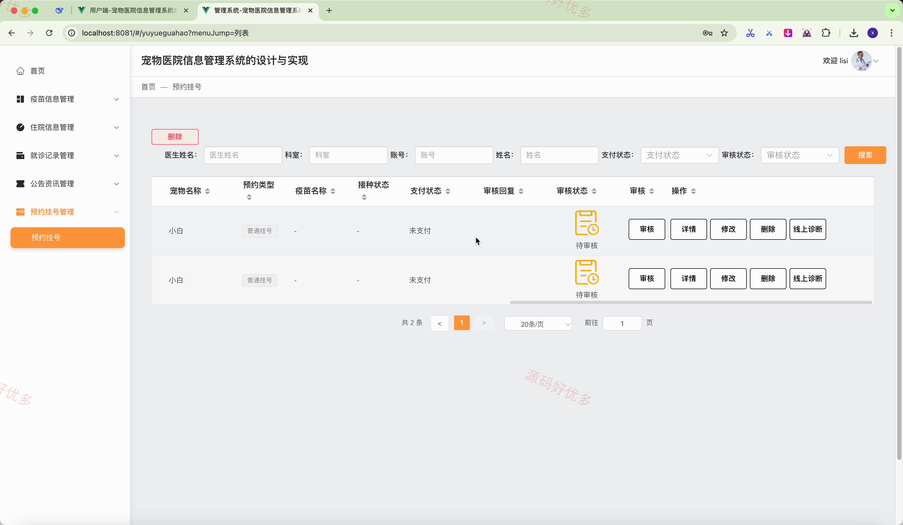
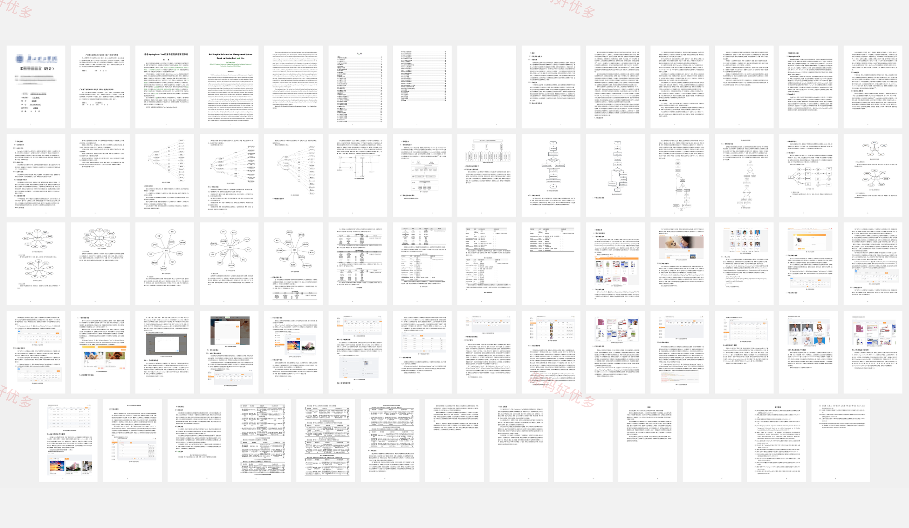

## 源码问题查看主页咨询

### 一、关键词
宠物医疗、预约挂号、在线诊疗、住院管理、药品购买、宠物领养

### 二、作品包含
源码+数据库+万字设计文档+全套环境和工具资源+本地部署教程

### 三、项目技术
前端技术： Html、Css、Js、Vue3.2、Element-Plus
后端技术：Java、SpringBoot3.3.0、MyBatis-Plus

### 四、运行环境（以下版本亲测，其他版本兼容性请自行测试）
开发工具：IDEA/eclipse + VSCODE

数据库：MySQL8.0+（共22张表）

数据库管理工具：Navicat10以上版本

环境配置软件： JDK17 + Maven3.6.3

前端Nodejs：16+

浏览器：谷歌浏览器

### 五、项目介绍
项目编号：springbootA632D

宠物医院信息管理系统面向用户、医生与管理员，串联宠物与药品信息浏览、预约挂号、在线诊疗、就诊医嘱、住院付费、疫苗接种和领养审核等业务，实现诊前预约、诊中服务与诊后管理的一体化协作。

角色：用户、医生、管理员

用户功能：浏览宠物与申请领养、查看药品与在线购买、查看医生与预约挂号、线上支付挂号及住院费用、查看就诊记录与医嘱、收藏宠物或医生、查看公告资讯、留言评价。

医生功能：查看疫苗信息、审核宠物领养申请、管理住院信息、填写就诊记录与医嘱、审核预约挂号、开展线上诊断、完成疫苗接种。

管理员功能：管理科室与医生、管理用户与宠物信息、管理药品及分类、管理疫苗与宠物分类、管理预约挂号与就诊记录、审核领养及药品购买、管理住院与线上咨询、管理公告和留言评价。

### 六、运行截图

